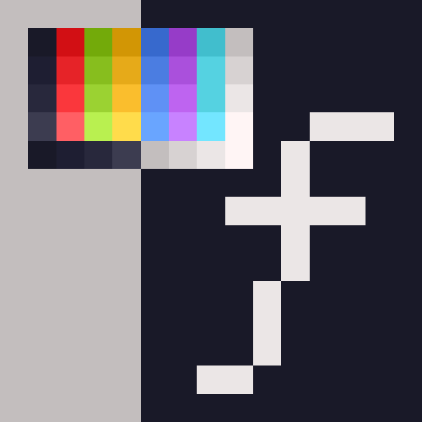
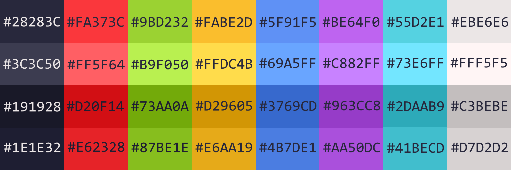
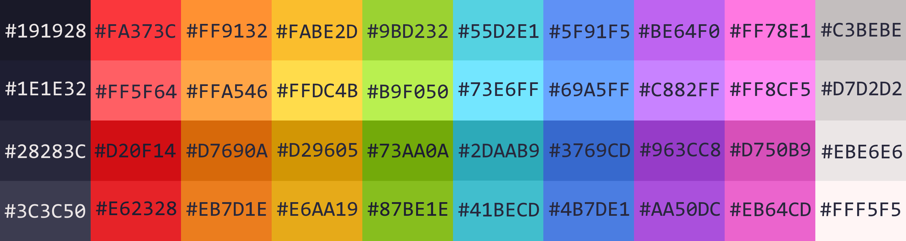
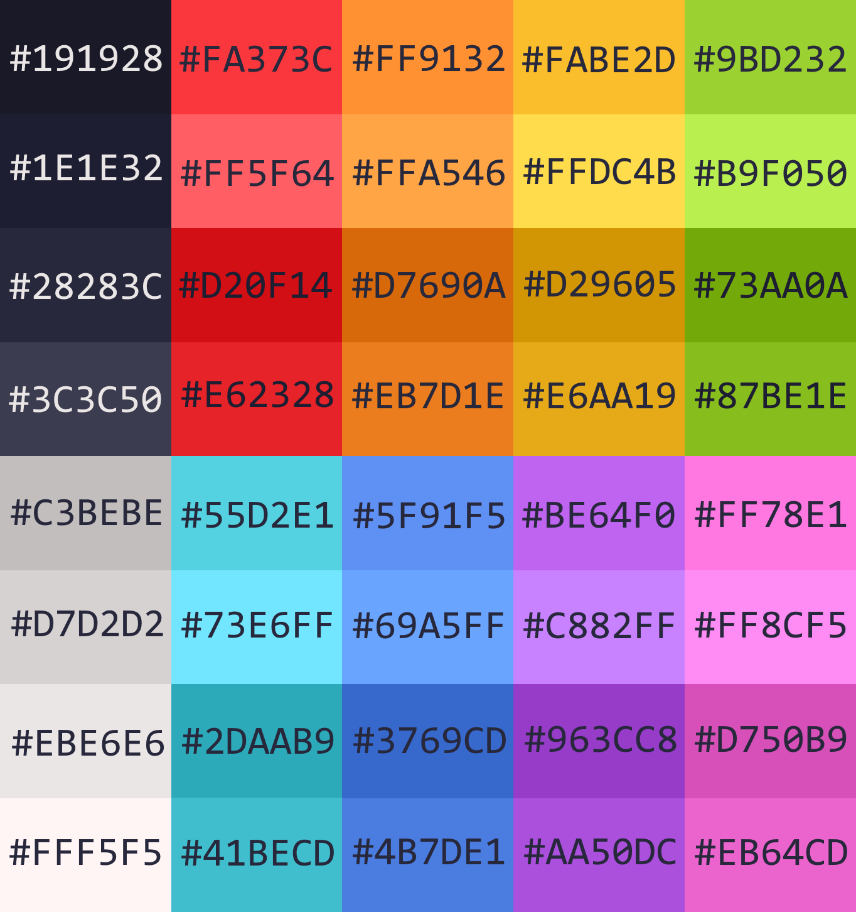

	

# Description

Colornstant - Perfect in ANY way colorscheme for people

Main idea behind colornstant colorscheme is to:
- To have all necessary range of colors:
	- Other colorschemes sometimes just don't have equivalent of color which user wants in their palette for one or another reason (mostly caused by skill issiu).
	- Colornstant colorscheme has equivalent of all 32 terminal colors and extra missing 8 colors such as orange and pink
	- Colornstant colorscheme will and going to add more colors if it gets REALLY necessary.
- Keep all the colors recognizable:
	- It can look good to use some shade of green instead of red but we all can presumably agree on that being annoying and confusing, because of that colornstant colorscheme has only shades of color x to show color x.
- Make all colors consistant and easy to remember:
	- All colors of colornstant colorscheme are made using its main foreground colors, other tones of colors are made by increasing or decreasing each RGB value of main foreground color by 20 digits, if doing so results in negative or higher than 255 values we round them to 0 and 255.
	- All RGB values of colornstant colorscheme end with 0 or 5 to keep it consistantly easy to remember.
	- Main foreground colors have been chosen manually to retain style of future colornstant colorscheme and with account of other colors being made with them.
	- Any patterns you can notice in HEX values of colornstant colorscheme are intentional to make HEX values easy to remember too.

# Colors

Colornstant colorscheme offers all 32 main terminal colors with extra 8 colors if user wants more specifice ones like pink, orange, or brown

- Main terminal colors:

	

- All colors:

	
	

## Reused colors

Color of mouse cursor is main foreground color of white: `#EBE6E6`

Regular/Default text's color is main foreground color of white: `#EBE6E6`

Background for dark themes is main background black: `#191928`

Background for light themes is main background white: `#C3BEBE`

## Main foreground colors
black: `#28283C` &nbsp; red: `#FA373C` &nbsp; green: `#9BD232` &nbsp; yellow: `#FABE2D` &nbsp; blue: `#5F91F5` &nbsp; purple: `#BE64F0` &nbsp; cyan: `#55D2E1` &nbsp; white: `#EBE6E6`

orange: `#FF9132` &nbsp; pink: `#FF78E1`

## Bright foreground colors
black: `#3C3C50` &nbsp; red: `#FF5F64` &nbsp; green: `#B9F050` &nbsp; yellow: `#FFDC4B` &nbsp; blue: `#69A5FF` &nbsp; purple: `#C882FF` &nbsp; cyan: `#73E6FF` &nbsp; white: `#FFF5F5`

orange: `#FFA546` &nbsp; pink: `#FF8CF5`

## Main background colors
black: `#191928` &nbsp; red: `#D20F14` &nbsp; green: `#73AA0A` &nbsp; yellow: `#D29605` &nbsp; blue: `#3769CD` &nbsp; purple: `#963CC8` &nbsp; cyan: `#2DAAB9` &nbsp; white: `#C3BEBE`

orange: `#D7690A` &nbsp; pink: `#D750B9`

## Bright background colors
black: `#1E1E32` &nbsp; red: `#E62328` &nbsp; green: `#87BE1E` &nbsp; yellow: `#E6AA19` &nbsp; blue: `#4B7DE1` &nbsp; purple: `#AA50DC` &nbsp; cyan: `#41BECD` &nbsp; white: `#D7D2D2`

orange: `#EB7D1E` &nbsp; pink: `#EB64CD`
