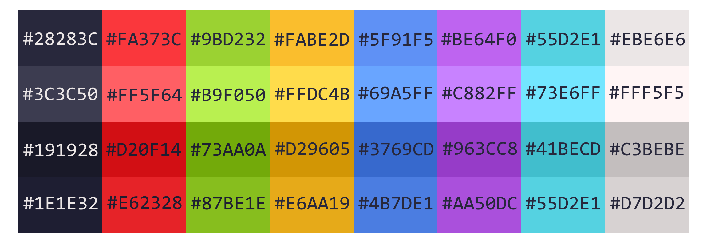

    

# Description

Colornstant - Perfect in ANY way colorscheme for people

Main idea behind colornstant colorscheme is to provide set/range of colors and their variations to fully satisfy need of them for any general usecase of user because other colorschemes sometimes just don't have uqeilant of color which user wants in their palette or one or another reason

# Colors

Colornstant colorscheme offers all 32 main terminal colors with extra 12 colors if user wants more specifice ones like pink or brown

    

